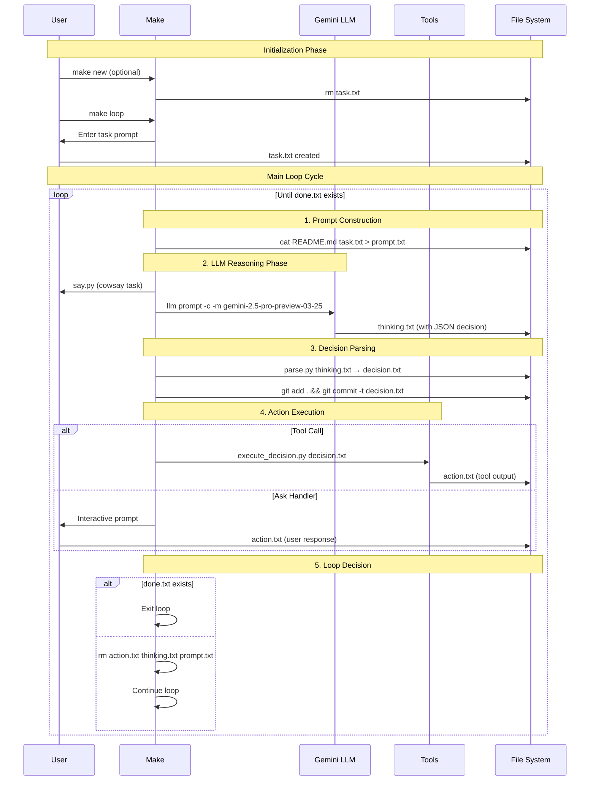

# Philby Interaction Flow Analysis

## Executive Summary

Philby is a conversational AI agent system that implements a predict-execute-reconcile loop using Make as the orchestration engine. This analysis documents its architecture and provides recommendations for porting to DSPy.

---

## System Architecture Overview



---

## Core Components Deep Dive

### 1. File-Based State Management

**Key Files and Lifecycle:**
- **`task.txt`**: User-defined objective (persistent across cycles)
- **`prompt.txt`**: Generated from `README.md + task.txt` (rebuilt each cycle)
- **`thinking.txt`**: LLM reasoning output with embedded JSON decision (cycle-specific)
- **`decision.txt`**: Parsed JSON action command (cycle-specific)
- **`action.txt`**: Execution result or user response (cycle-specific)
- **`done.txt`**: Loop termination signal (user-controlled)

**Intermediate File Pattern:**
```bash
# Clean slate
make sparkle  # rm -f thinking.txt decision.txt prompt.txt

# Dependency chain
prompt.txt ← README.md + task.txt
thinking.txt ← prompt.txt + LLM call
decision.txt ← thinking.txt + parse.py
action.txt ← decision.txt + execute_decision.py
```

### 2. LLM Integration Architecture

**Input Pipeline:**
1. **Context Assembly**: `README.md` (system prompt) + `task.txt` (current objective)
2. **History Preservation**: LLM sees full conversation history via piped input
3. **Prediction Requirement**: LLM must include predictions before decisions

**Output Processing:**
1. **Structured Output**: LLM generates `thinking.txt` with embedded JSON
2. **JSON Extraction**: `parse.py` uses regex to extract decision JSON
3. **Schema Validation**: Pydantic models enforce decision structure

**Decision Schema:**
```python
class Decision(BaseModel):
    tool_call: Optional[ToolCall] = None      # {name: str, args: Dict}
    ask_handler: Optional[AskHandler] = None  # {prompt: str}
    timestamp: str = Field(default_factory=lambda: datetime.utcnow().isoformat())
```

### 3. Tool Execution Framework

**Current Tool Support:**
- `read_file(file_path)`: File content retrieval
- `write_file(file_path, content)`: File content writing  
- `list_files(directory)`: Directory listing
- Interactive prompts via `ask_handler`

**Execution Flow:**
```python
# execute_decision.py workflow
decision_data = json.loads(decision_file)

if decision_data.get("decision_type") == "Tool Call":
    result = execute_tool(tool_name, tool_args)
elif decision_data.get("decision_type") == "Ask Handler":
    result = prompt_user(prompt_text)
    
action_file.write(result)
```

---

## Behavioral Patterns Observed

### 1. Predict-Execute-Reconcile Loop

**Core Philosophy:**
> "Every cycle is a small wager on the world: the model projects what will happen, reality answers back, and the next thought grows in the space between the two."

**Implementation:**
1. **Prediction Phase**: LLM generates explicit forecasts in `thinking.txt`
2. **Execution Phase**: Tools/user interaction produces ground truth in `action.txt`
3. **Reconciliation Phase**: Next cycle's context includes both prediction and outcome

### 2. Make-Based Orchestration

**Benefits Observed:**
- **Dependency Management**: Automatic rebuilding when inputs change
- **Incremental Processing**: Only regenerate what's needed
- **Debuggability**: Clear file artifacts at each step
- **Extensibility**: Easy to add new targets and dependencies

**Make Targets Analysis:**
```makefile
# Core workflow
all: loop
loop: action.txt → (recursive until done.txt)
action.txt: decision.txt → execute_decision.py
decision.txt: thinking.txt → parse.py + git commit
thinking.txt: prompt.txt + api.key → LLM call
prompt.txt: README.md + task.txt → concatenation

# Utilities  
sparkle: → rm intermediate files
new: → rm task.txt (fresh start)
clean: sparkle + rm venv
```

### 3. Version Control Integration

**Git as State Tracker:**
- Each decision gets committed with JSON as commit message
- Provides audit trail of agent decisions
- Failed commits trigger cleanup (removes decision.txt)
- Git history becomes conversation log

---

## DSPy Porting Analysis

### Current Challenges for DSPy Migration

1. **File-Based State**: DSPy prefers in-memory state management
2. **Make Dependencies**: DSPy has its own optimization and caching systems
3. **Manual Parsing**: DSPy handles structured output natively 
4. **Tool Integration**: DSPy has different patterns for function calling

### Recommended DSPy Architecture

```python
import dspy
from typing import List, Optional

class PhilbySignature(dspy.Signature):
    """Predict-Execute-Reconcile agent cycle"""
    context = dspy.InputField(desc="README + task + conversation history")
    predictions = dspy.OutputField(desc="Explicit forecasts about what will happen")
    decision = dspy.OutputField(desc="JSON tool call or question", format="json")

class PhilbyModule(dspy.Module):
    def __init__(self):
        super().__init__()
        self.reasoner = dspy.ChainOfThought(PhilbySignature)
        self.tools = ToolRegistry()
        
    def forward(self, task: str, history: List[dict]) -> dict:
        # 1. Build context
        context = self._build_context(task, history)
        
        # 2. Get LLM decision
        result = self.reasoner(context=context)
        
        # 3. Execute decision
        action_result = self._execute_decision(result.decision)
        
        # 4. Update history
        history.append({
            "predictions": result.predictions,
            "decision": result.decision,
            "outcome": action_result
        })
        
        return {"result": action_result, "history": history}
```

### Key DSPy Advantages for Philby

1. **Automatic Optimization**: DSPy can optimize the reasoning prompt
2. **Native JSON Handling**: No need for regex-based parsing
3. **Metric-Driven Learning**: Can optimize prediction accuracy
4. **Cleaner Abstractions**: Modules vs Make targets

### Migration Strategy

**Phase 1: Core Loop Replication**
- Implement `PhilbyModule` with basic predict-execute cycle
- Maintain file-based state initially for comparison
- Preserve tool calling interface

**Phase 2: State Management Migration**  
- Move from files to in-memory conversation history
- Implement proper checkpointing for long conversations
- Add conversation summarization for context window management

**Phase 3: Optimization Integration**
- Add prediction accuracy metrics
- Implement DSPy optimizers for prompt tuning
- A/B test against original Philby performance

**Phase 4: Tool Ecosystem Expansion**
- Integrate with broader tool libraries (LangChain tools, etc.)
- Add multi-modal capabilities
- Implement parallel tool execution

---

## Key Insights for DSPy Port

### What to Preserve
1. **Predict-Execute-Reconcile Philosophy**: Core learning mechanism
2. **Explicit Predictions**: Forces model commitment and enables learning
3. **Tool Calling Interface**: Clean separation of reasoning and execution
4. **Conversation History**: Context preservation is crucial

### What to Enhance  
1. **State Management**: Move from files to structured memory
2. **Error Handling**: More robust failure recovery
3. **Tool Registry**: Dynamic tool discovery and registration
4. **Optimization**: Automatic prompt and parameter tuning

### What to Simplify
1. **JSON Parsing**: Use DSPy's native structured output
2. **Dependency Management**: Leverage DSPy's caching
3. **Git Integration**: Optional audit trail rather than core requirement

---

## Implementation Recommendations

### 1. DSPy Module Structure
```python
class PhilbyAgent(dspy.Module):
    def __init__(self, tools: List[Tool]):
        self.reasoner = dspy.ChainOfThought(PhilbySignature) 
        self.tool_executor = ToolExecutor(tools)
        self.memory = ConversationMemory()
        
    def step(self, task: str) -> AgentResult:
        """Single predict-execute-reconcile cycle"""
        pass
        
    def run(self, task: str, max_steps: int = 100) -> List[AgentResult]:
        """Full conversation until completion"""
        pass
```

### 2. Tool Integration Pattern
```python
@dspy.tool
def read_file(file_path: str) -> str:
    """Read contents of a file"""
    # Implementation
    
@dspy.tool  
def write_file(file_path: str, content: str) -> str:
    """Write content to a file"""  
    # Implementation
```

### 3. Metrics for Optimization
- **Prediction Accuracy**: How often predictions match outcomes
- **Task Completion Rate**: Success rate for given objectives
- **Tool Usage Efficiency**: Optimal tool selection patterns
- **Conversation Length**: Steps to completion

---

## Conclusion

Philby represents a sophisticated implementation of the predict-execute-reconcile pattern using Make for orchestration. The DSPy port should preserve its core learning philosophy while leveraging DSPy's optimization capabilities and cleaner abstractions. The file-based state management, while debuggable, can be replaced with structured memory management for better performance and scalability.

The key success factor will be maintaining the explicit prediction requirement that drives the model's learning and self-improvement over time.