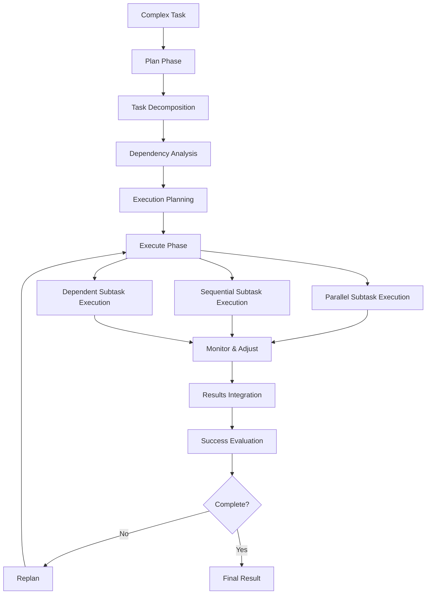
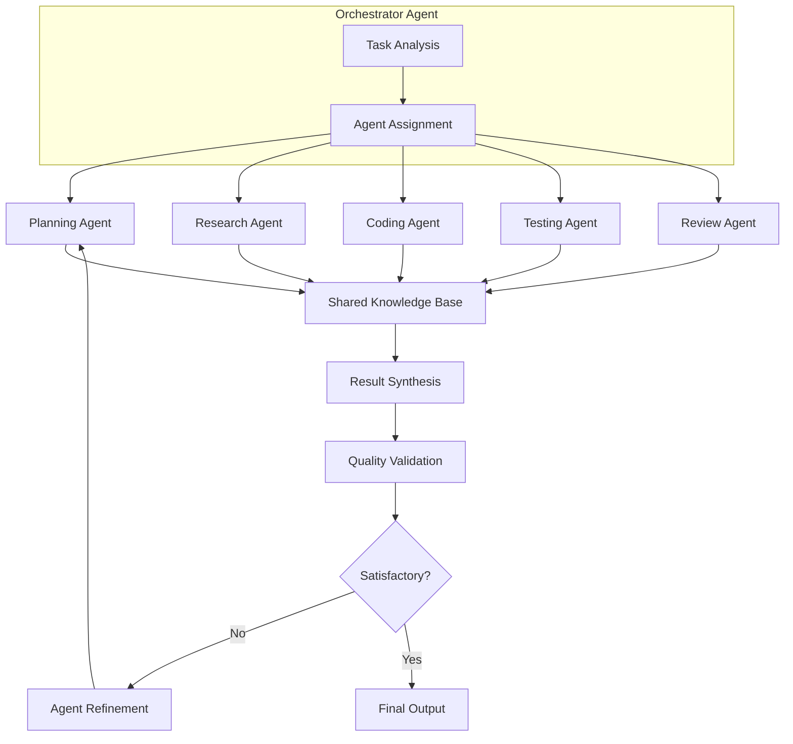
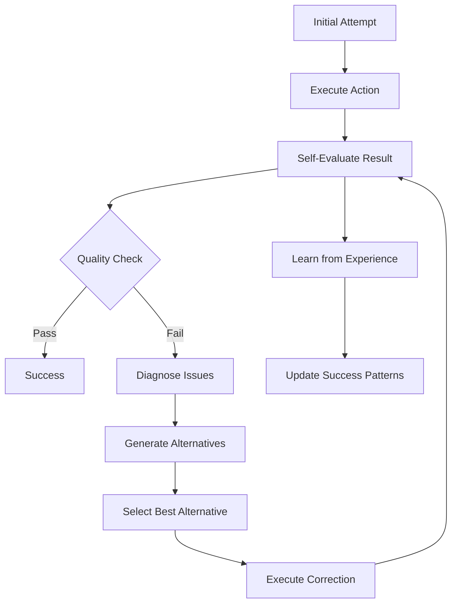
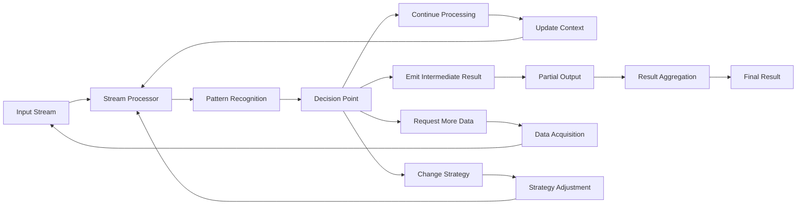
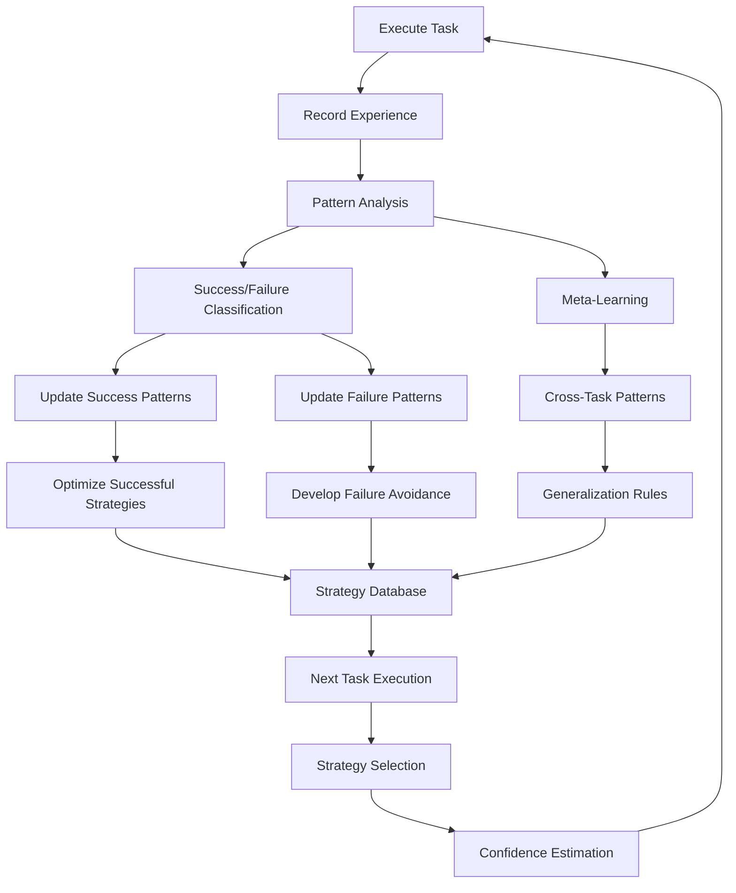

# Enhanced Philby Workflow for Powerful LLMs

## Executive Summary

This document outlines enhanced workflow patterns that leverage the advanced capabilities of modern LLMs (GPT-4, Claude 3.5+, Gemini Ultra) to overcome the limitations of the current single-step Philby architecture. The proposed workflows enable multi-step planning, parallel execution, self-correction, and continuous learning.

---

## Current Workflow Limitations Analysis

### Critical Constraints in Existing Philby

1. **Single-Step Decision Bottleneck**
   - Each cycle produces exactly one action
   - No ability to plan multi-step solutions
   - Complex tasks require many cycles with poor coordination

2. **Limited Tool Ecosystem**
   ```python
   # Current tools
   tools = ["read_file", "write_file", "list_files"]
   # Missing: web search, API calls, data processing, analysis, etc.
   ```

3. **Linear Processing Model**
   ```mermaid
   graph LR
       A[Think] --> B[Decide] --> C[Execute] --> D[Reconcile] --> A
   ```
   - No branching logic
   - No parallel execution
   - No error recovery paths

4. **Primitive Context Management**
   - File-based state becomes unwieldy at scale
   - No conversation summarization
   - Manual context window management

5. **Weak Error Handling**
   - Git commit failures cause hard stops
   - No retry mechanisms
   - No graceful degradation

---

## Enhanced Workflow Architectures

### 1. Hierarchical Planning Workflow (HPW)

**Concept**: Decompose complex tasks into hierarchical subtasks with dependency management.



**Implementation Pattern**:
```python
class HierarchicalPlanningWorkflow(dspy.Module):
    def __init__(self):
        self.planner = dspy.ChainOfThought(PlanningSignature)
        self.executor = ParallelExecutor()
        self.monitor = ExecutionMonitor()
        
    def forward(self, complex_task: str) -> WorkflowResult:
        # Phase 1: Hierarchical Planning
        plan = self.planner(
            task=complex_task,
            capabilities=self.get_available_tools(),
            constraints=self.get_constraints()
        )
        
        # Phase 2: Dependency Resolution
        execution_order = self.resolve_dependencies(plan.subtasks)
        
        # Phase 3: Parallel Execution
        results = {}
        for batch in execution_order:
            batch_results = self.executor.run_parallel(batch)
            results.update(batch_results)
            
            # Phase 4: Continuous Monitoring
            if self.monitor.needs_replanning(results):
                plan = self.replan(plan, results)
                execution_order = self.resolve_dependencies(plan.remaining_tasks)
        
        return self.integrate_results(results)
```

**Key Advantages**:
- **Efficient Parallelization**: Independent subtasks run concurrently
- **Dependency Awareness**: Respects task interdependencies
- **Dynamic Replanning**: Adjusts plan based on intermediate results
- **Resource Optimization**: Better utilization of LLM capabilities

---

### 2. Multi-Agent Collaboration Workflow (MACW)

**Concept**: Specialized agents collaborate on different aspects of complex problems.



**Specialized Agent Types**:

```python
class PlannerAgent(dspy.Module):
    """Breaks down complex tasks into actionable steps"""
    signature = dspy.Signature(
        "task -> step_by_step_plan, resource_requirements, success_criteria"
    )

class ResearchAgent(dspy.Module):
    """Gathers information and analyzes context"""
    signature = dspy.Signature(
        "research_query -> findings, sources, relevance_score"
    )

class CodingAgent(dspy.Module):
    """Implements solutions and writes code"""
    signature = dspy.Signature(
        "specification, context -> code, tests, documentation"
    )

class ReviewAgent(dspy.Module):
    """Validates quality and suggests improvements"""
    signature = dspy.Signature(
        "artifact, criteria -> quality_assessment, improvement_suggestions"
    )
```

**Implementation Framework**:
```python
class MultiAgentWorkflow(dspy.Module):
    def __init__(self):
        self.orchestrator = OrchestratorAgent()
        self.agents = {
            'planner': PlannerAgent(),
            'researcher': ResearchAgent(), 
            'coder': CodingAgent(),
            'tester': TestingAgent(),
            'reviewer': ReviewAgent()
        }
        self.knowledge_base = SharedKnowledgeBase()
        
    def forward(self, complex_task: str) -> CollaborativeResult:
        # Orchestration Phase
        assignment = self.orchestrator(
            task=complex_task,
            available_agents=list(self.agents.keys())
        )
        
        # Parallel Agent Execution
        results = {}
        for agent_name, subtask in assignment.assignments:
            agent = self.agents[agent_name]
            context = self.knowledge_base.get_relevant_context(subtask)
            result = agent(subtask=subtask, context=context)
            
            # Update shared knowledge
            self.knowledge_base.update(agent_name, subtask, result)
            results[agent_name] = result
            
        # Result Integration & Quality Check
        integrated = self.integrate_agent_results(results)
        quality_check = self.agents['reviewer'](
            artifact=integrated,
            criteria=assignment.success_criteria
        )
        
        if quality_check.needs_improvement:
            return self.refine_with_feedback(integrated, quality_check.suggestions)
        
        return integrated
```

---

### 3. Self-Correcting Workflow (SCW)

**Concept**: Continuous self-evaluation and improvement during execution.



**Self-Evaluation Framework**:
```python
class SelfCorrectingSignature(dspy.Signature):
    """Self-evaluating action execution with correction capabilities"""
    task = dspy.InputField(desc="The task to execute")
    previous_attempts = dspy.InputField(desc="Previous attempts and their outcomes")
    action = dspy.OutputField(desc="The action to take")
    confidence = dspy.OutputField(desc="Confidence in this action (0-1)")
    success_criteria = dspy.OutputField(desc="How to evaluate success")
    fallback_plans = dspy.OutputField(desc="Alternative approaches if this fails")

class SelfCorrectingWorkflow(dspy.Module):
    def __init__(self):
        self.actor = dspy.ChainOfThought(SelfCorrectingSignature)
        self.evaluator = OutcomeEvaluator()
        self.corrector = ErrorCorrector()
        self.learner = ExperienceLearner()
        
    def forward(self, task: str, max_attempts: int = 3) -> CorrectedResult:
        attempts = []
        
        for attempt_num in range(max_attempts):
            # Generate action with self-awareness
            response = self.actor(
                task=task,
                previous_attempts=attempts
            )
            
            # Execute the action
            result = self.execute_action(response.action)
            
            # Evaluate the outcome
            evaluation = self.evaluator(
                result=result,
                criteria=response.success_criteria,
                confidence=response.confidence
            )
            
            attempts.append({
                'action': response.action,
                'result': result,
                'evaluation': evaluation,
                'confidence': response.confidence
            })
            
            # Check if successful
            if evaluation.success:
                self.learner.record_success(task, attempts)
                return CorrectedResult(
                    final_result=result,
                    attempts=attempts,
                    success=True
                )
            
            # If not successful, analyze and correct
            if attempt_num < max_attempts - 1:
                correction = self.corrector(
                    failed_attempts=attempts,
                    fallback_plans=response.fallback_plans
                )
                # Continue with corrected approach
        
        # Max attempts reached
        self.learner.record_failure(task, attempts)
        return CorrectedResult(
            final_result=attempts[-1]['result'],
            attempts=attempts,
            success=False
        )
```

---

### 4. Streaming Execution Workflow (SEW)

**Concept**: Process and respond to information as it streams in, enabling real-time adaptation.



**Streaming Implementation**:
```python
class StreamingWorkflow(dspy.Module):
    def __init__(self):
        self.stream_processor = StreamProcessor()
        self.pattern_recognizer = PatternRecognizer()
        self.decision_maker = StreamingDecisionMaker()
        self.context_manager = StreamingContextManager()
        
    def process_stream(self, input_stream: Iterator[Any]) -> Iterator[StreamingResult]:
        context = self.context_manager.initialize()
        
        for chunk in input_stream:
            # Process incoming data
            processed_chunk = self.stream_processor(chunk, context)
            
            # Recognize patterns in the stream
            patterns = self.pattern_recognizer(processed_chunk, context.history)
            
            # Make streaming decisions
            decision = self.decision_maker(
                current_chunk=processed_chunk,
                patterns=patterns,
                context=context
            )
            
            # Execute decision
            if decision.action == "emit_result":
                yield StreamingResult(
                    partial_result=decision.result,
                    confidence=decision.confidence,
                    needs_more_data=False
                )
            elif decision.action == "continue":
                context = self.context_manager.update(context, processed_chunk)
            elif decision.action == "request_data":
                yield StreamingResult(
                    request=decision.data_request,
                    needs_more_data=True
                )
            elif decision.action == "change_strategy":
                self.adapt_strategy(decision.new_strategy)
                context = self.context_manager.update(context, processed_chunk)
```

---

### 5. Learning & Optimization Workflow (LOW)

**Concept**: Continuously improve performance through experience accumulation and pattern learning.



**Learning Implementation**:
```python
class LearningWorkflow(dspy.Module):
    def __init__(self):
        self.executor = AdaptiveExecutor()
        self.experience_recorder = ExperienceRecorder()
        self.pattern_learner = PatternLearner()
        self.strategy_optimizer = StrategyOptimizer()
        self.meta_learner = MetaLearner()
        
    def forward(self, task: str) -> LearningResult:
        # Retrieve relevant past experiences
        similar_experiences = self.experience_recorder.find_similar(task)
        
        # Select strategy based on learned patterns
        strategy = self.strategy_optimizer.select_best_strategy(
            task=task,
            experiences=similar_experiences
        )
        
        # Execute with confidence estimation
        result = self.executor(
            task=task,
            strategy=strategy,
            confidence_threshold=0.7
        )
        
        # Record the experience
        experience = Experience(
            task=task,
            strategy=strategy,
            result=result,
            success=result.success,
            context=result.context
        )
        self.experience_recorder.add(experience)
        
        # Learn from this execution
        patterns = self.pattern_learner.analyze(experience, similar_experiences)
        self.strategy_optimizer.update(patterns)
        
        # Meta-learning across task types
        self.meta_learner.update_cross_task_patterns(experience)
        
        return LearningResult(
            primary_result=result,
            learned_patterns=patterns,
            strategy_improvements=self.strategy_optimizer.get_improvements(),
            confidence_in_future_similar_tasks=self.estimate_future_confidence(task)
        )

class Experience(BaseModel):
    task: str
    strategy: Dict[str, Any]
    result: Any
    success: bool
    context: Dict[str, Any]
    timestamp: datetime
    execution_time: float
    resource_usage: Dict[str, float]
```

---

## Tool Ecosystem Expansion

### Advanced Tool Categories

**1. Information Processing Tools**
```python
# Web & API Tools
web_search(query: str, num_results: int = 10) -> SearchResults
api_call(endpoint: str, method: str, params: dict) -> APIResponse
scrape_webpage(url: str, selectors: List[str]) -> ScrapedData

# Data Analysis Tools  
analyze_data(data: Any, analysis_type: str) -> AnalysisResult
generate_visualization(data: Any, chart_type: str) -> Visualization
statistical_summary(data: List[float]) -> StatsSummary

# Code Tools
execute_code(code: str, language: str) -> ExecutionResult
run_tests(test_file: str) -> TestResults
lint_code(code: str, language: str) -> LintResults
```

**2. Collaborative Tools**
```python
# Communication Tools
send_message(recipient: str, message: str) -> MessageResult
create_shared_document(content: str, collaborators: List[str]) -> Document
schedule_meeting(participants: List[str], duration: int) -> Meeting

# Project Management Tools
create_task(title: str, description: str, assignee: str) -> Task
update_task_status(task_id: str, status: str) -> Task
get_project_status(project_id: str) -> ProjectStatus
```

**3. Creative & Generation Tools**
```python
# Content Generation
generate_image(prompt: str, style: str) -> Image
create_presentation(outline: Dict, template: str) -> Presentation
write_document(topic: str, style: str, length: int) -> Document

# Problem Solving Tools
brainstorm_solutions(problem: str, constraints: List[str]) -> SolutionList
evaluate_options(options: List[str], criteria: List[str]) -> RankedOptions
synthesize_information(sources: List[str], focus: str) -> Synthesis
```

---

## Implementation Roadmap

### Phase 1: Enhanced Planning (Months 1-2)
**Objectives**:
- Implement Hierarchical Planning Workflow
- Add multi-step task decomposition
- Build dependency resolution system  

**Key Components**:
```python
class PlanningModule(dspy.Module):
    def __init__(self):
        self.task_decomposer = TaskDecomposer()
        self.dependency_resolver = DependencyResolver()
        self.resource_estimator = ResourceEstimator()
        
    def create_execution_plan(self, task: str) -> ExecutionPlan:
        # Decompose into subtasks
        subtasks = self.task_decomposer(task)
        
        # Resolve dependencies
        execution_order = self.dependency_resolver(subtasks)
        
        # Estimate resources needed
        resource_requirements = self.resource_estimator(execution_order)
        
        return ExecutionPlan(
            subtasks=subtasks,
            execution_order=execution_order,
            resources=resource_requirements
        )
```

**Success Metrics**:
- Successfully decompose 90% of complex tasks
- Reduce total execution time by 40% through parallelization
- Improve success rate on multi-step tasks by 60%

### Phase 2: Tool Ecosystem (Months 2-3)
**Objectives**:
- Expand tool library to 50+ tools
- Implement tool composition and chaining
- Add dynamic tool discovery

**Tool Registry System**:
```python
class DynamicToolRegistry:
    def __init__(self):
        self.tools = {}
        self.tool_metadata = {}
        self.usage_patterns = {}
        
    def register_tool(self, tool_func: Callable, metadata: ToolMetadata):
        self.tools[tool_func.__name__] = tool_func
        self.tool_metadata[tool_func.__name__] = metadata
        
    def discover_tools_for_task(self, task_description: str) -> List[str]:
        # Use LLM to match task requirements with available tools
        relevant_tools = self.llm_tool_matcher(task_description, self.tool_metadata)
        return relevant_tools
        
    def compose_tool_chain(self, tools: List[str], data_flow: Dict) -> ToolChain:
        # Create optimized tool execution chain
        return ToolChain(tools, data_flow)
```

### Phase 3: Multi-Agent Collaboration (Months 3-4)
**Objectives**:
- Deploy specialized agent types
- Implement shared knowledge base
- Add inter-agent communication protocols

**Agent Communication Framework**:
```python
class AgentCommunicationBus:
    def __init__(self):
        self.message_queue = MessageQueue()
        self.knowledge_base = SharedKnowledgeBase()
        self.coordination_protocol = CoordinationProtocol()
        
    def broadcast_finding(self, agent_id: str, finding: Finding):
        # Share discoveries with relevant agents
        relevant_agents = self.find_interested_agents(finding.topic)
        for agent in relevant_agents:
            self.message_queue.send(agent, finding)
            
    def request_collaboration(self, requesting_agent: str, task: str, 
                            required_expertise: List[str]) -> CollaborationResponse:
        # Find agents with required expertise
        expert_agents = self.find_experts(required_expertise)
        
        # Coordinate collaboration
        return self.coordination_protocol.organize_collaboration(
            requesting_agent, expert_agents, task
        )
```

### Phase 4: Self-Correction & Learning (Months 4-5)
**Objectives**:
- Implement continuous self-improvement
- Add failure analysis and recovery
- Build experience-based optimization

**Self-Improvement Engine**:
```python
class SelfImprovementEngine:
    def __init__(self):
        self.performance_tracker = PerformanceTracker()
        self.failure_analyzer = FailureAnalyzer()
        self.strategy_evolver = StrategyEvolver()
        
    def analyze_performance_trends(self) -> PerformanceAnalysis:
        # Identify improving and declining patterns
        recent_performance = self.performance_tracker.get_recent_metrics()
        return self.analyze_trends(recent_performance)
        
    def evolve_strategies(self, performance_analysis: PerformanceAnalysis):
        # Adapt strategies based on what's working
        successful_patterns = performance_analysis.successful_patterns
        failing_patterns = performance_analysis.failing_patterns
        
        # Reinforce successful approaches
        self.strategy_evolver.reinforce_patterns(successful_patterns)
        
        # Develop alternatives for failing approaches
        self.strategy_evolver.create_alternatives(failing_patterns)
```

### Phase 5: Advanced Integration (Months 5-6)
**Objectives**:
- Integrate all workflow types
- Optimize cross-workflow coordination
- Deploy comprehensive testing suite

**Unified Workflow Orchestrator**:
```python
class UnifiedWorkflowOrchestrator(dspy.Module):
    def __init__(self):
        self.workflows = {
            'hierarchical_planning': HierarchicalPlanningWorkflow(),
            'multi_agent': MultiAgentWorkflow(),
            'self_correcting': SelfCorrectingWorkflow(),
            'streaming': StreamingWorkflow(),
            'learning': LearningWorkflow()
        }
        self.workflow_selector = WorkflowSelector()
        self.coordinator = WorkflowCoordinator()
        
    def forward(self, task: str, context: Dict) -> UnifiedResult:
        # Select optimal workflow combination
        workflow_plan = self.workflow_selector(
            task=task,
            context=context,
            available_workflows=list(self.workflows.keys())
        )
        
        # Coordinate execution across multiple workflows
        results = {}
        for workflow_name, workflow_config in workflow_plan.workflows:
            workflow = self.workflows[workflow_name]
            result = workflow(
                task=workflow_config.subtask,
                context=workflow_config.context
            )
            results[workflow_name] = result
            
        # Integrate results
        return self.coordinator.integrate_workflow_results(results)
```

---

## Performance Benchmarking

### Evaluation Metrics

**1. Task Completion Metrics**
- **Success Rate**: % of tasks completed successfully
- **Efficiency**: Average steps/time per task complexity level
- **Quality**: Human evaluation scores on output quality
- **Resource Usage**: Compute and API costs per task

**2. Learning & Adaptation Metrics**
- **Improvement Rate**: Performance gains over time
- **Transfer Learning**: Success on similar tasks after experience
- **Error Recovery**: % of initially failed tasks that succeed after correction
- **Pattern Recognition**: Accuracy in identifying successful strategies

**3. Workflow-Specific Metrics**
- **Planning Accuracy**: % of plans that execute successfully
- **Parallelization Efficiency**: Speedup from parallel execution
- **Agent Collaboration Quality**: Inter-agent coordination success
- **Self-Correction Effectiveness**: Improvement from correction cycles

### Benchmark Tasks

**Category 1: Code Development**
- Build a full-stack web application
- Debug and optimize existing codebase
- Create comprehensive test suite
- Generate technical documentation

**Category 2: Research & Analysis**
- Conduct literature review on technical topic
- Analyze large dataset and generate insights
- Compare competing solutions and recommend best
- Synthesize information from multiple sources

**Category 3: Creative Problem Solving**
- Design system architecture for complex requirements
- Generate multiple solution approaches to novel problem
- Create content strategy for product launch
- Develop training curriculum for technical skill

---

## Conclusion

The enhanced workflow patterns leverage the advanced reasoning, planning, and execution capabilities of powerful LLMs to overcome the fundamental limitations of the current single-step Philby architecture. By implementing hierarchical planning, multi-agent collaboration, self-correction, streaming execution, and continuous learning, we can create an AI agent system that:

1. **Handles Complex Tasks**: Multi-step planning and execution
2. **Operates Efficiently**: Parallel processing and resource optimization  
3. **Learns Continuously**: Experience-based improvement and adaptation
4. **Recovers from Errors**: Self-correction and alternative strategy generation
5. **Collaborates Effectively**: Specialized agents working together

The proposed implementation roadmap provides a structured approach to building these capabilities incrementally, with clear success metrics and benchmarking frameworks to measure progress.

This enhanced Philby represents a significant evolution from a simple predict-execute-reconcile loop to a sophisticated, multi-modal AI agent platform capable of tackling the most complex real-world challenges.